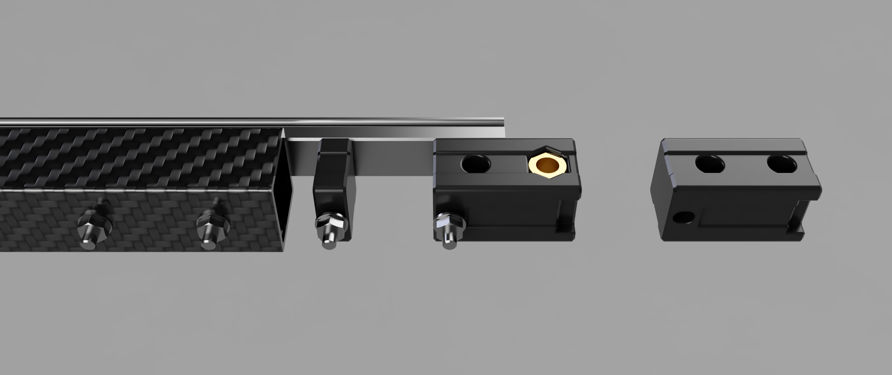
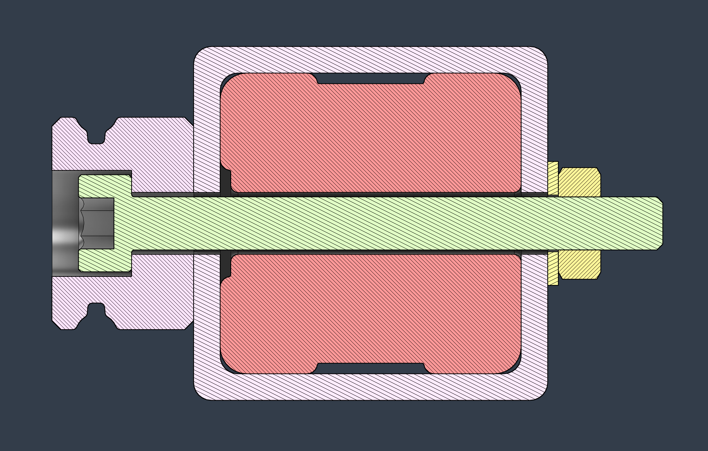

# Better CF tube mounting

*If you have questions, consider joining the Discord server.*

## What's this?
This is a 20x20mm square tube mounting solution that utilizes through-bolts and printed inserts to maximize the torsional rigidity of the X-axis.

## Section view

## BOM for rail mounting:

*The MGN9 hole distance from the end of the rail usually varies based on the manufacturer and the length of the rail. You most likely have to leave out the first and last hole when using MGN9.
It is recommended to use the rest of the available screws on a rail.*

**Common hardware option for MGN9:**

M3x25 SHCS + M3 washer + low-profile M3 hex nut

**Common hardware option for MGN12:**

M3x30 SHCS + M3 washer + standard M3 hex nut

*Titanium screws in a more aesthetically pleasing length bring some weight reduction without a loss of rigidity.*

**Recommended hardware option for both:**

Titanium M3x27 BHCS + M3 washer + low profile M3 hex nut

## BOM for XY joint mounting
### DISCLAIMER: The XY joint insert geometry with hex standoffs is untested at the moment.

There are two versions of the inserts: one uses the traditional 2 + 1 Voron-layout, the other uses 2 through-bolts to clamp the XY joint.

**2 + 1 config:**

|No.|Description|Qty|
|---|---|---|
|1.|M5 BHCS in the correct length for your XY joint|6 pcs|
|2.|M5x15 hex F-F standoff |2 pcs|
|3.|M5 hex nut|2 pcs|

**Through-bolt config:**

|No.|Description|Qty|
|---|---|---|
|1.|M5 BHCS in the correct length for your XY joint|4 pcs|
|2.|M5 hex nut|4 pcs|
