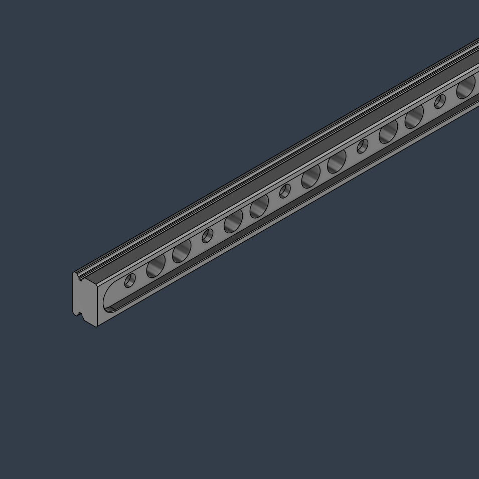
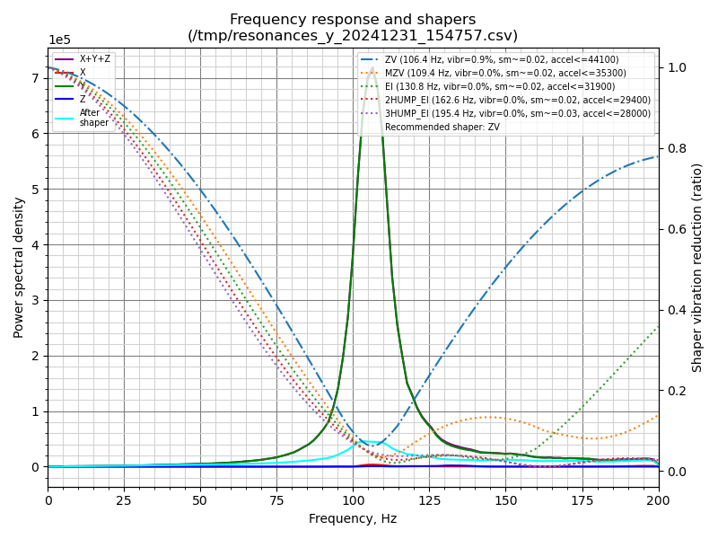
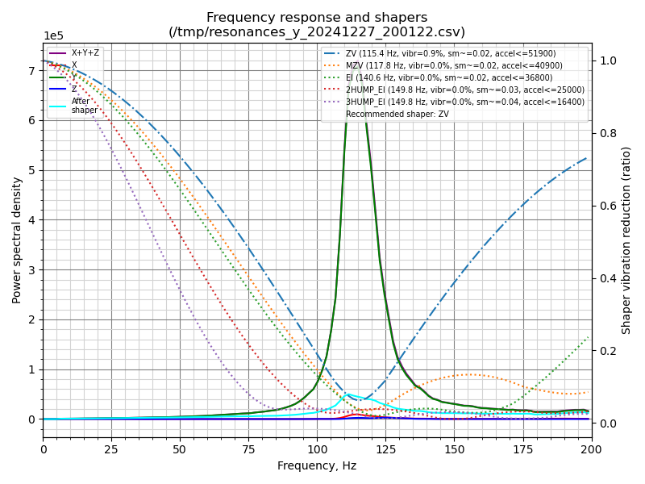

# Hollow MGN12 Rails

Here's my revised hollow rail CAD in the 3 common sizes.

Please make sure that your rail's dimensions are the same before machining because even my LDO rails have different counterbore depths. Also, due to the unpredictable internal stresses, there's no way to guarantee that the preload won't be affected in some cases.

### My results:
- 300mm V2.4
- 4040 verticals, structural panels
- 8xSLM Z carriage
- AWD sheet metal Monolith
- 4x2504s @2.5A
- 20x20x16 CF tube
- Monolith toolhead

### Solid rail:

### Hollow rail:

