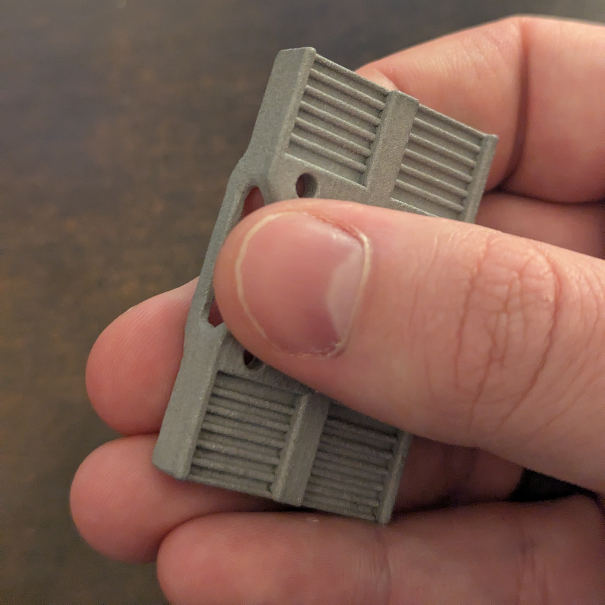
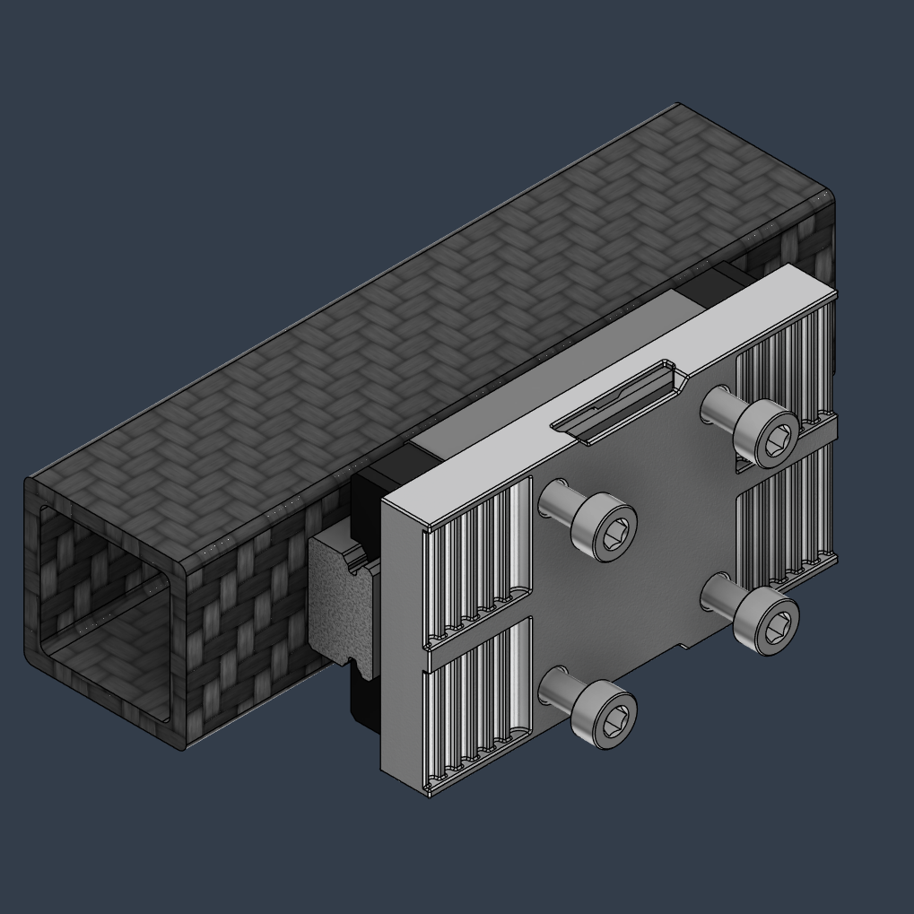
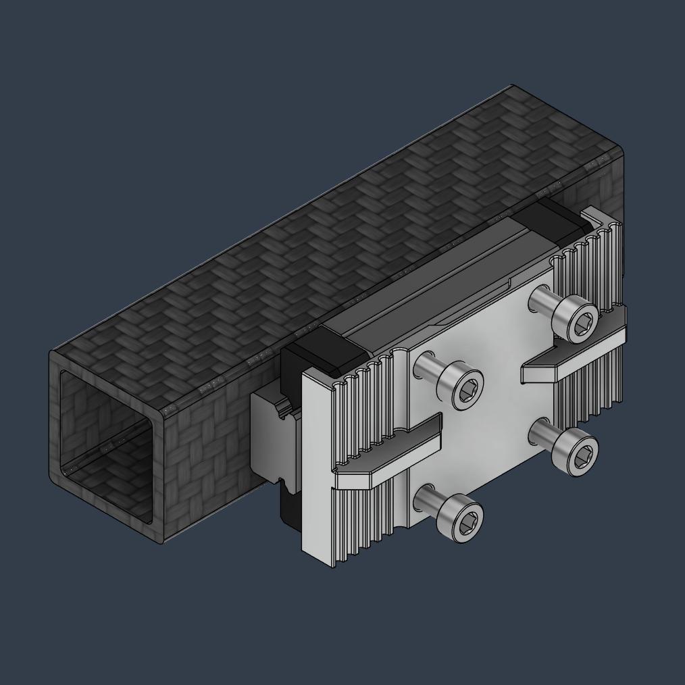

# SLM belt clamps for the Monolith belt path

## What's this?

These are standalone versions of the Monolith toolhead's belt clamp to help with toolhead development/conversion for the belt path. Even if the rest of the toolhead carriage is plastic, this method can be pretty robust and compact.

### The Monolith's flipped belt path is one belt's thickness away from the X MGN12H carriage's surface. Therefore, it's possible to design a thin SLM belt clamp around the carriage with the following design goals:
- Single-piece
- Very light and space-efficient compared to other solutions
- Achieve the minimum 6T count recommended by Gates (no damage to the belt teeth at spec tension and high accels)
- The belt section under load is completely straight (no minimum bending radius violation)
- Narrow enough to achieve the standard X-travels (250, 300, 350)
- Can clip onto the carriage without screws until the rest of the toolhead is installed
- No vertical space constraint (universal, supports belts up to 12mm)
- Excess belt on the outside
- With only 2 screws partially tightened it's easy to pull the belt's other end to take out all the slack before tensioning

> [!NOTE]
> **If you have questions or want to stay more up-to-date with Monolith, consider joining the dedicated Discord server.**
>
> 
>
> **If you would like to see more of this and other projects in the future, consider supporting me on Ko-fi.**
>
> 

