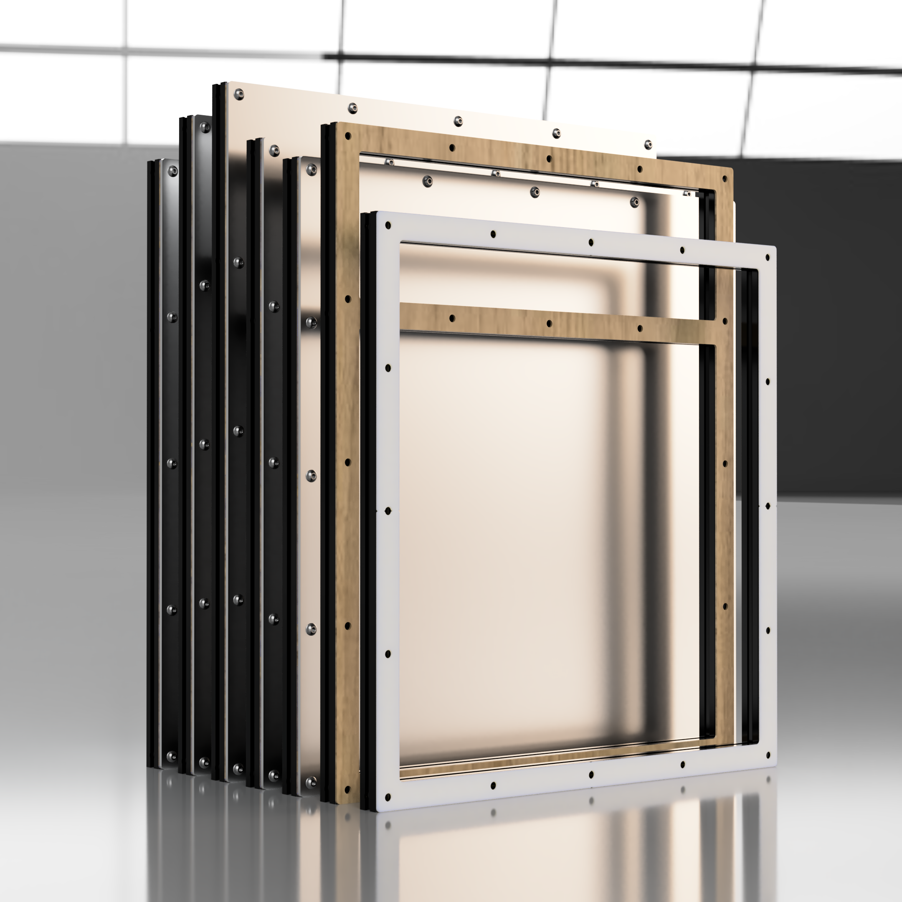

# Structural Side Panels V2-VT

## What's this?

Structural Side Panels for the common V2-VT sizes

If I could only add a single mod to a stock Voron frame I'd do structural side panels, so here they are.

The CAD has 3mm thick panels with 2mm gaskets meant to be used with M5x10 BHCS screws and roll-in T-nuts, but thicknesses and materials can be switched up, of course.

### Please double-check the frame size of your printer before ordering the panels!
