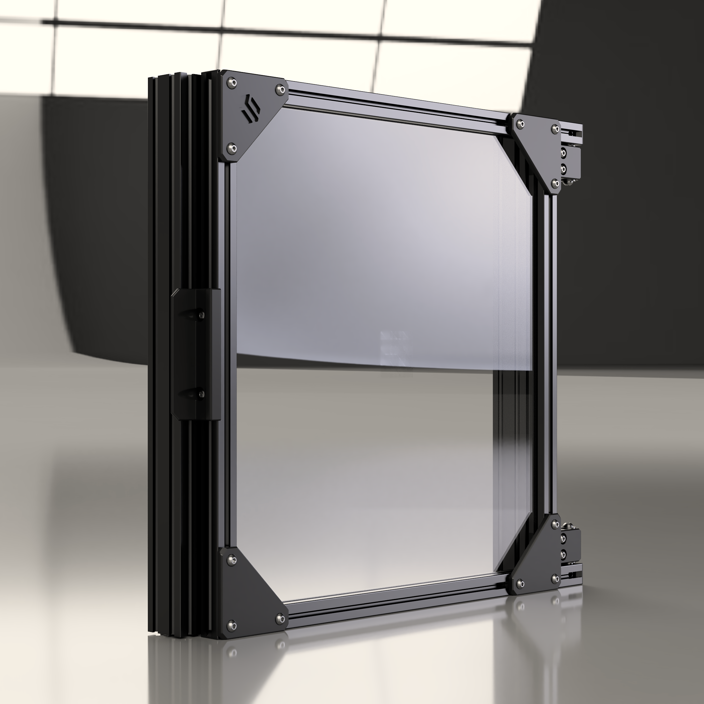

# Wacky-Hack Fridge Door 
> [!IMPORTANT]
> **I haven't tested the latest version of the door handle yet.**

## What's this?

Many of us have already switched to 4040 vertical extrusions and structural side panels, so I wanted to reuse the stock parts for an extrusion door. The door only uses the front extrusion slots so that the sides can have full coverage panels and/or insulation. The hinges have double F695 bearings, and if the side panel allows for it the door can be opened to almost 270 degrees.

On V2 if you have a lightweight X-beam and want to avoid cutting one of your vertical extrusions you can also reuse your stock X-extrusion with some additional hardware and printed parts.

## BOM and more details SOON™!

> [!NOTE]
> **If you have questions or want to stay more up-to-date with Monolith, consider joining the dedicated Discord server.**
>
> 
>
> **If you would like to see more of this and other projects in the future, consider supporting me on Ko-fi.**
>
> 
